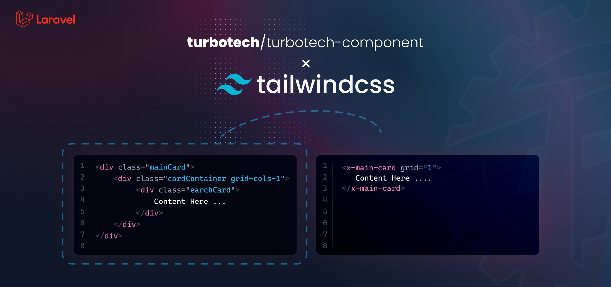

<p align="center">
<a href="https://laravel.com" target="_blank">

</a>
</p>

<p align="center">
<a href="https://packagist.org/packages/turbotech/turbotech-component"></a>
</p>

# About turbotech/turbotech-component
Build for SmartERP, and SmartPOS Components

# Installation

#### You can install the package via composer:

```bash
composer require turbotech/turbotech-component
```

#   Usage 

#### Inside `providers` of `config/app.php` 
```php
'providers' => [

    /*
    * Laravel Framework Service Providers...
    */
    ...
    TURBOTECH\Component\ServicesProvider::class,
]
```

#### Inside `providers` of `composer.json` 

```json
   "autoload": {
        "psr-4": {
            ...
            "TURBOTECH\\Component\\":"vendor/turbotech/turbotech-component/src"
        }
    },
```
#### Tailwindcss Styling Support:
Add `./vendor/turbotech/turbotech-component/src/view/*.blade.php` inside `content` to compiling style from package.
```js
content: [
    ...
    "./vendor/turbotech/turbotech-component/src/view/*.blade.php",
    "./vendor/turbotech/turbotech-component/src/view/**/*.blade.php",
    "./vendor/turbotech/turbotech-component/src/view/**/**/*.blade.php",
    "./vendor/turbotech/turbotech-component/src/view/**/**/**/*.blade.php",
],

```

#### If compiling via Laravel Modules package:
```js
const path = require('path'); 
```
```js
content: [
    ...
    path.join(__dirname, "./vendor/turbotech/turbotech-component/src/view/*.blade.php"),
    path.join(__dirname, "./vendor/turbotech/turbotech-component/src/view/**/*.blade.php"),
    path.join(__dirname, "./vendor/turbotech/turbotech-component/src/view/**/**/*.blade.php"),
    path.join(__dirname, "./vendor/turbotech/turbotech-component/src/view/**/**/**/*.blade.php"),
]
```
then compile css with Tailwindcss

```bash
npm run watch
```

to start server
```bash
php artisan serve
```
<!-- #   Components
-   [`Elements`](documents/elements/)
    -   [`Buttons`](documents/elements/buttons.md) : <small>`(New)`</small>
    -   [`Button Groups`](documents/elements/buttons.md#-group-buttons) : <small>`(New)`</small>
    -   `Headers`: Coming soon
    -   `Flyout Menus`: Coming soon
    -   `Banners`: Coming soon
    -   `Badges`: Coming soon
    -   `Dropdowns`: Coming soon

-   `Sections` : Coming soon
    -   `Headings Sections`: Coming soon
    -   `Hero Sections`: Coming soon
    -   `Feature Sections`: Coming soon
    -   `CTA Sections`: Coming soon
    -   `Pricing Sections`: Coming soon
    -   `Header Sections`: Coming soon
    -   `Newsletter Sections`: Coming soon
    -   `Stats`: Coming soon
    -   `Testimonials`: Coming soon
    -   `Blog Sections`: Coming soon
    -   `Contact Sections`: Coming soon
    -   `Team Sections`: Coming soon
    -   `Logo Clouds`: Coming soon
    -   `FAQs`: Coming soon
    -   `Footers`: Coming soon
    
-   `Page Status` : Coming soon
    -   `404 Pages`: Coming soon
    -   `500 Pages`: Coming soon

-   [`Layout`](documents/layouts/) 
    -   [`Container`](documents/layouts/container.md): <small>`(New)`</small>
    -   [`Card`](documents/layouts/container.md#x-card): <small>`(New)`</small>
    -   `Panels`: Coming soon
    -   `List containers`: Coming soon
    -   `Media Objects`: Coming soon
    -   `Dividers`: Coming soon

-   [`Display`](documents/display/)
    -   [`Stats`](documents/display/stats.md#x-stats): <small>`(New)`</small> -->
#   Contributors

- [PPhat](https://github.com/pphatDev) 

    <!-- Thank you for considering contributing to `Sophat/Elements`! You can read the contribution guide [here](CONTRIBUTING.md). -->
#   Community

#   License

The MIT License (MIT). Please see [License File](LICENSE) for more information.